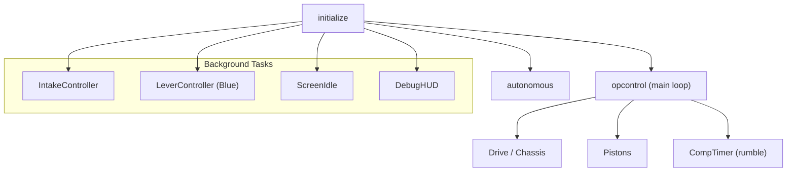

# VEX Push Back - Codebase

*A modular, multithreaded control stack built with PROS for [VEX Robotics Competition](https://www.vexrobotics.com/v5/competition/vrc-current-game).*

[](https://pros.cs.purdue.edu)
[](https://ez-robotics.github.io/EZ-Template/)

---

## Project Overview

This repository contains the **competition-ready control stack** for GATR1 (University of Florida) during the **Push Back** season. A single codebase builds for two physical robots via compile-time selection (`ROBOT_BLUE` / `ROBOT_ORANGE`):

- Scores balls into long and middle goals with robot-specific mechanisms (lever FSM on Blue; two-stage intake on Orange)
- Runs **matchload → score → wing** autonomous cycles with EZ-Template motion chaining
- Uses a **PID-tuned 8-motor chassis** with odometry, slew limiting, and boomerang planners
- Isolates **multithreaded subsystems** (Intake, Lever, Comp Timer, Screen HUD) under PROS RTOS
- Shares ports, controls, and auton lists per robot under `include/config/`

| Variant              | Intake                      | Scoring                           | Notes                           |
| -------------------- | --------------------------- | --------------------------------- | ------------------------------- |
| **Blue** (lever bot) | Single-stage bottom rollers | Lever + gate (long / middle goal) | Four-bar, wing, lever FSM       |
| **Orange** (S bot)   | Two-stage (bottom + top)    | Gate + four-bar positioning       | Score-long / score-middle modes |


---

## Key Features


| Category                      | Highlight                                                             |
| ----------------------------- | --------------------------------------------------------------------- |
| **Dual-Robot Build**          | One repo → Blue or Orange via `robot_select.hpp`                      |
| **Lever Scoring (Blue)**      | Position PID + FSM (IDLE → SCORE → RETRACT → ZERO) with gate coupling |
| **Two-Stage Intake (Orange)** | Collect / score-long / score-middle states with reverse macro         |
| **Auton Selector**            | LCD + limit-switch interface for match, elims, skills, and PID tuning |
| **PID-Driven Chassis**        | Independent drive / turn / swing / odom loops with slew-rate limiting |
| **Pneumatics API**            | HOLD / TOGGLE wrappers with optional hardware reversal                |
| **Rumble Alerts**             | Controller buzz at 20 s remaining, then 10–1 s countdown              |
| **Multithreading**            | PROS tasks isolate Intake, Lever, Screen idle, and debug HUD          |

---

## Mechanism Demos


| Clip | Behaviors Highlighted |
| ---- | --------------------- |
|  | PID drive and turn — chassis tracks distance and heading
|  | Matchloader — pneumatic arm cycles balls from the matchload station |
|  | Wing — extend / retract for goal defense and ball control |


---

## High-Level Architecture




---

## Building

Requires [PROS](https://pros.cs.purdue.edu/) with EZ-Template installed (see `project.pros`).

Select exactly one robot before building by copying the example header and defining either `ROBOT_BLUE` or `ROBOT_ORANGE`:

```bash
cp include/config/robot_select.hpp.example include/config/robot_select.hpp
# Edit robot_select.hpp: uncomment ROBOT_BLUE or ROBOT_ORANGE
make
```

The build fails if neither macro is defined. `robot_select.hpp` is gitignored so each machine can pick a robot locally.

---

## Project Layout

```
include/
  config/          Blue & Orange ports, controls, auton declarations
  core/            Globals, util, subsystems (drive, intake, pistons, lever, …)
  screen/          Brain LCD debug pages and idle splash
src/
  core/            main.cpp, globals, subsystem implementations
  autons/          Per-robot PID constants, selector list, routines
  screen/          Idle logo task and debug HUD
```

